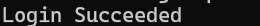
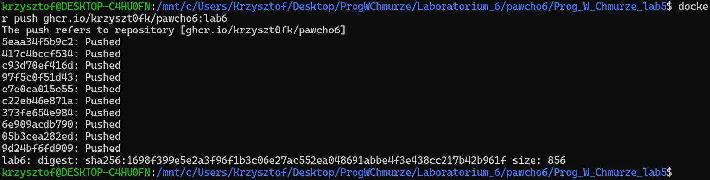

# Sprawozdanie LAB 6
## Utworzenie repozytorium

## Klonowanie repozytorium z LAB 5

## Zmiana w Dockerfile 
W pliku Dockerfile7 w pierwszej kolejności została dodana składnia:
```shell
# syntax=docker/dockerfile:1.2
```
Jest ona używana w celu określenia, którą wersję składni Dockerfile należy użyć podczas budowania obrazu.

Następnie zmodyfikowane zostało polecenie RUN
```shell
RUN apk update && \
    apk add --no-cache nodejs \
    && apk add --no-cache openssh-client git \
    && mkdir -p -m 0700 ~/.ssh \
    && ssh-keyscan github.com >> ~/.ssh/known_hosts \
    && eval $(ssh-agent)
```
Powyższe polecenie instaluje Node.js, Git i klienta SSH w Alpine oraz przygotowuje konfigurację SSH, tworząc katalog ~/.ssh i dodając klucz GitHuba do zaufanych hostów. Na końcu uruchamia agenta SSH, aby umożliwić uwierzytelnianie kluczem prywatnym

Na koniec dodane zostało polecenie:
```shell
RUN --mount=type=ssh git clone git@github.com:krzyszt0fk/pawcho6.git pawcho6
```
Powoduje ono klonowanie repozytorium z Github do środowiska Dockera, przy użyciu klucza SSH

Po wprowadzonych zmianach plik Dockerfile7 zawiera: 
```shell
# syntax=docker/dockerfile:1.2
#etap1
FROM scratch as stage1

ADD alpine-minirootfs-3.21.3-x86_64.tar.gz /

ARG VERSION=1.0.0
ENV APP_VERSION=$VERSION
#deklaracja katalogu roboczego
WORKDIR /usr/app

#node js dla alpine
RUN apk update && \
    apk add --no-cache nodejs \
    && apk add --no-cache openssh-client git \
    && mkdir -p -m 0700 ~/.ssh \
    && ssh-keyscan github.com >> ~/.ssh/known_hosts \
    && eval $(ssh-agent)

COPY ./index.js ./

RUN --mount=type=ssh git clone git@github.com:krzyszt0fk/pawcho6.git pawcho6

#Etap2
FROM nginx as stage2

ARG VERSION=1.0.0
ENV APP_VERSION=$VERSION

RUN apt-get update && \ 
    apt-get install -y nodejs && \
    apt-get clean && \
    rm -rf /var/lib/apt/lists/*

COPY --from=stage1 /usr/app /usr/share/nginx/html

EXPOSE 80

HEALTHCHECK --interval=30s --timeout=3s \
    CMD curl -fs http://localhost/ || exit 1


CMD ["node", "/usr/share/nginx/html/index.js"]

```
## Zbudowanie obrazu


## Nadanie obrazowi tag-u lab6
Do wykonania tego zadania zostało użyte polecenie: 
```shell
docker tag lab6 ghcr.io/krzyszt0fk/pawcho6:lab6
```
## Następnie logowanie do repozytorium ghcr.io zakończone sukcesem

## Wysyłanie obrazu do repozytorium GitHub

### W ostatnim etapie została zmieniona widoczność obrazu na Public oraz obraz powiązany został z repozytorium pawcho6
